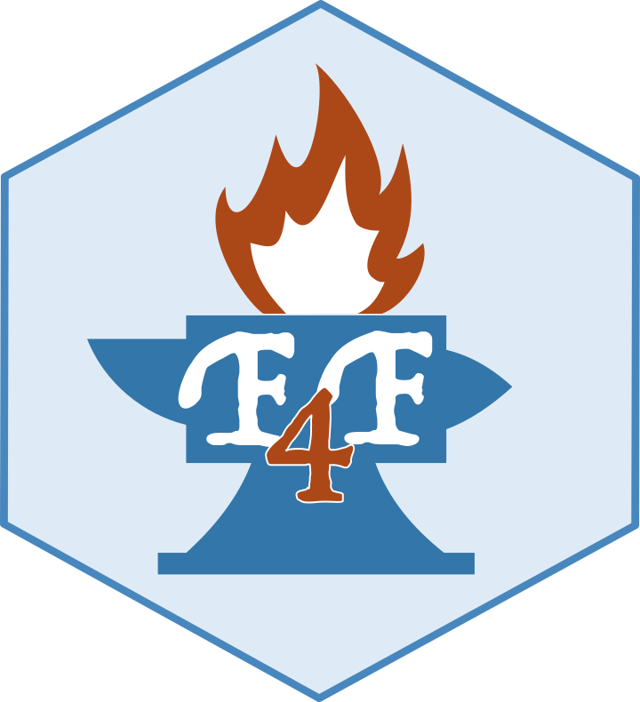

# Forge4Flame (F4F)

<p align="center">
  
</p>

Forge4Flame (F4F) is a user-friendly R Shiny dashboard designed to streamline the creation of FLAME GPU 2 [1, 2] ABMs, automatically generating the necessary code. With its intuitive interface, users can easily define key components, including the model’s environment, the agents interacting within it, the disease model, and other essential elements for agent-based simulations.

See <a href="https://github.com/qBioTurin/FORGE4FLAME/blob/main/UserGuide.pdf">user guide</a> for more information. 

## How to download
### Repository
Cloning the repository is optional, especially for users intending to use the F4F package, dockers, or Slurm---see the following sections for more details. To clone it, use the following Bash command:
```
git clone --recurse-submodules https://github.com/qBioTurin/FORGE4FLAME.git
```
The main directory, `FORGE4FLAME`, contains the R Shiny application, while the `FORGE4FLAME/inst/FLAMEGPU\-FORGE4FLAME` directory stores the FLAME GPU 2 template used by F4F.

### F4F
To install the F4F R package it is possible to use the R package devtools [3] or remotes [4], through these R commands:
```r
if(!requireNamespace("devtools", quietly = TRUE))
  install.packages("devtools")
        
library(devtools)
install_github("https://github.com/qBioTurin/FORGE4FLAME")
```
or
```r
if(!requireNamespace("remotes", quietly = TRUE))
  install.packages("remotes")
        
library(remotes)
install_github("https://github.com/qBioTurin/FORGE4FLAME")
```

### Dependencies
F4F is implemented in R Shiny. It requires several CRAN packages to operate: 
```
shiny-dashboard, shinyjs, jsonlite, dplyr, shinythemes, colourpicker, glue, readr, zip, sortable, shinyalert, shinybusy, shinyBS, stringr, gg-plot2, tidyr, DT, shiny, shinyWidgets, shinyFiles, htmltools.
```
These packages are automatically installed. Furthermore, it also requires the EBImage and the EBImageExtra packages. The user must install these packages manually using the following R commands:

```r
if (!requireNamespace ("BiocManager" , quietly = TRUE))
  install.packages("BiocManager")

BiocManager::install ("EBImage")

if(!requireNamespace ("remotes " , quietly = TRUE))
  install.packages ( "remotes")

library (remotes)
install_github ("ornelles/EBImageExtra")
```

### FLAMEGPU2 
To install FLAME GPU 2 dependencies, refer to the official documentation [here](https://github.com/FLAMEGPU/FLAMEGPU2).

## Docker
Users can download the Docker images for FLAME GPU 2 to avoid any potential dependency-related issues. In this context, the user must have Docker installed on their
computer. For more information, refer to [this document](https://docs.docker.com/engine/installation/).

Additionally, the user needs to ensure they have the necessary permissions to run Docker without using sudo. To create the Docker group and add the user on a Unix
system, follow these steps:

• Create the docker group:
```
$ sudo groupadd docker
```

• Add user to the docker group:

```
$ sudo usermod -aG docker $USER
```

• Log out and log back in so that group membership is re-evaluated.

Additionally, the user must have the NVIDIA driver (installation instructions can be found [here](https://www.nvidia.com/en-us/drivers/)) and the NVIDIA container toolkit (installation instructions can be found [here](https://docs.nvidia.com/datacenter/cloud-native/container-toolkit/latest/install-guide.html)) installed.
To download the Docker images, run the following Bash commands:

```
docker pull qbioturin/forge4flame
docker pull qbioturin/flamegpu2
```
An alternative method for downloading Docker images is via F4F, provided that the user has installed the R package for installation instructions):
```r
library(FORGE4FLAME)
FORGE4FLAME::downloadContainers()
```

## Slurm
To run FLAME GPU 2 simulations on an HPC system, the user must install Slurm on it (more information [here](https://slurm.schedmd.com/quickstart_admin.html)). Generally, Docker cannot be used on HPC systems due to privacy concerns. Therefore, the user must install all necessary FLAME GPU 2 dependencies on the user's system before running simulations.
However, on HPC4AI [1] (more information [here](https://hpc4ai.unito.it/documentation/)), FLAME GPU 2 can also be executed using Docker, thanks to a tool that addresses privacy concerns.

## How to Run
### F4F
#### Without Docker
To run F4F without using Docker, run the following R commands after installing the package (see above):

```r
library(FORGE4FLAME)
FORGE4FLAME::FORGE4FLAME.run()
```

#### With Docker
To run it using Docker, execute the following Bash command (if running on a server, ensure that port 3838 is exposed and accessible via http://<server-hostname>:3838; if running locally, access at \url{http://localhost:3838/}):
```
docker run -p 3838:3838 qbioturin/forge4flame
```
In this case, there is no need to download the F4F repository or install the package. In addition, it is not possible to run a FLAME GPU 2 simulation using the _Run_ button in the **Run** page. 

### FLAME GPU 2
#### Without docker
To run FLAME GPU 2 without using Docker, run the following Bash command:

```
# Executing a single run without using the FLAME GPU 2
# 3D visualization:

./abm.sh -expdir NameOfTheModel

#############################################################

# Executing a single run using the FLAME GPU 2
# 3D visualization:

./abm.sh -expdir NameOfTheModel -v ON

#############################################################

# Executing n runs without using the FLAME GPU 2
# 3D visualization:

./abm_ensemble.sh -expdir NameOfTheModel

#############################################################

# Visualize the helper:

./abm.sh -h
./abm_ensemble.sh -h

```

In particular, `NameOfTheModel` must be the name of the desired model and must correspond to a directory within `FLAMEGPU-FORGE4FLAME/resources/f4f` that contains both a JSON file and an RDs file. Results will be saved in `FLAMEGPU-FORGE4FLAME/results/NameOfTheModel`.

#### With docker
To run FLAME GPU 2 using Docker, run the following Bash commands:

```
# Executing a single run without using the FLAMEGPU2 3D visualization :

docker run --user $UID:$UID --rm --gpus all --runtime nvidia -v /Absolute/Path/To/The/Directory/With/The/Model/NameOfTheModel:/home/docker/flamegpu2/FLAMEGPU-FORGE4FLAME/resources/f4f/NameOfTheModel -v $(pwd):/home/docker/flamegpu2/FLAMEGPU-FORGE4FLAME/flamegpu2_results qbioturin/flamegpu2/usr/bin/bash -c "/home/docker/flamegpu2/FLAMEGPU-FORGE4FLAME/abm.sh -expdir NameOfTheModel"

######################## ##### ##### ##### ##### ##### ###### ######
# Executing n runs without using the FLAMEGPU2 3D visualization :

docker run --user $UID:$UID --rm --gpus all --runtime nvidia -v /Absolute/Path/To/The/Directory/With/The/Model/NameOfTheModel:/home/docker/flamegpu2/FLAMEGPU-FORGE4FLAME/resources/f4f/NameOfTheModel -v $(pwd):/home/docker/flamegpu2/FLAMEGPU-FORGE4FLAME/flamegpu2_results
qbioturin/flamegpu2/usr/bin/bash -c "/home/docker/flamegpu2/FLAMEGPU-FORGE4FLAME/abm_ensemble.sh -expdir NameOfTheModel"
```

In particular, `/Absolute/Path/To/The/Directory/With/The/Model/NameOfTheModel` represents the absolute path to the local directory that contains the model to run (the JSON and the RDs files). These files will be saved in a
directory named `NameOfTheModel` inside the Docker (in `FLAMEGPU-FORGE4FLAME/resources/f4f`). Results will be saved in a directory named `results/NameOfTheModel` within the current directory. The user must replace the directory name containing the model with `NameOfTheModel`.

## Docker Compose
To use the Docker Compose, the user must download the YAML file [here](https://github.com/qBioTurin/FORGE4FLAME/blob/main/inst/Compose/docker-compose.yml). To start both F4F and FLAME GPU 2 containers, navigate to the directory containing the YAML file and run the following Bash command (if running on a server, ensure that port 3839 is exposed and accessible via http://<server-hostname>:3839; if running locally, access to http://localhost:3839):
```
docker compose up -d --build
```
To run a FLAME GPU 2 simulation using Docker Compose, the user must use the Run page of F4F. Results will be saved in a directory named `results/NameOfTheModel` within the current directory, where \texttt{NameOfTheModel} is the name selected by the user when clicking on the *Run* button in the **Run** page. To stop the containers, run the following Bash command:
```
docker compose down
```

## Slurm
To execute FLAME GPU 2 simulations on HPC systems using Slurm, assuming the necessary drivers are installed, the repository is cloned, and one or more reservations have been made on the HPC system, a Bash script like the one below can be used (this script, named `run_on_slurm.sh`, is included in the repository):
```
#!/bin/bash

# Define arrays
PARTITIONS=("MachineName1-booked", "MachineName2-booked", ..., "MachineNameN-booked")
RESERVATIONS=("Run1", "Run2", ..., "RunN")
GRES=("GPUName1", "GPUName2", ..., "GPUNameN")
MODEL_NAMES=("NameOfTheModel1", "NameOfTheModel2", ..., "NameOfTheModelN")

ARRAY_LENGTH=${#PARTITIONS[@]}

for ((i=0; i<ARRAY_LENGTH; i++)); do
    JOB_SCRIPT="job_script$i.sh"
    
    cat <<EOF > "$JOB_SCRIPT"
#!/bin/bash
#SBATCH --partition=${PARTITIONS[$i]}
#SBATCH --reservation=${RESERVATIONS[$i]}
#SBATCH -N 1
#SBATCH --gres=${GRES[$i]}

./abm_ensemble.sh -expdir ${MODEL_NAMES[$i]}
EOF

    # Submit the job and check if it was successful
    if sbatch "$JOB_SCRIPT"; then
        echo "Submitted: $JOB_SCRIPT"
    else
        echo "Failed to submit: $JOB_SCRIPT" >&2
    fi
done
```

In this script, the user can define a set of partitions, reservations, GPUs, and model names by specifying the four vectors:
- `PARTITIONS` specifies the names of the machines reserved.
- `RESERVATIONS` defines the reservation names chosen by the user at booking time.
- `GRES` determines the name of the GPUs.
- `MODEL_NAMES` specifies the names of the models to run, which must correspond to the folder names within `FLAMEGPU-FORGE4FLAME/resources/f4f`.

Specifically, we run the experiments presented in the main document using Slurm on HPC4AI [1] (more information [here](https://hpc4ai.unito.it/documentation/)).

## How to reproduce the results
To reproduce the results presented in the main document---comparing FLAME GPU 2 and NetLogo using the ITP and the alert scenarios---run the following Bash commands (note that this process may take time, especially for NetLogo):
```
git clone -b School --recurse-submodules https://github.com/qBioTurin/FLAMEGPU-FORGE4FLAME.git

cd FLAMEGPU-FORGE4FLAME

# Reproduce results on comparison
# between FLAME GPU 2 and NetLogo:
./reproduce_comparison.sh

# Reproduce results on alert
# scenarios:
./reproduce_alert.sh
```

<p align="center">
  <a href="https://qbio.di.unito.it/">
    
  </a>
</p>

# Diclaimer:
F4F developers have no liability for any use of F4F functions, including without limitation, any loss of data, incorrect results, or any costs, liabilities, or damages that result from the use of F4F. 

# How to cite

```
Baccega, Daniele and Terrone, Irene and Heywood, Peter and Chisholm, Robert and Richmond, P.
and Contaldo, Sandro Gepiro and Bosio, Lorenzo and Pernice, Simone and Beccuti, Marco,
Forge4flame: An Intuitive Dashboard for Designing Gpu Agent-Based Models to Simulate
Infectious Disease Spread. Available at SSRN: http://dx.doi.org/10.2139/ssrn.5194584
```

# References
- [1] Paul Richmond et al. “FLAME GPU 2: A framework for flexible and performant agent based simulation on GPUs”. In: Software: Practice and Experience (2023). doi: https://doi.org/10.1002/spe.3207.

- [2] Paul Richmond et al. FLAME GPU. Version 2.0.0-rc. Dec. 2022. doi: 10.5281/zenodo.7434228. url: https://doi.org/10.5281/zenodo.7434228.

- [3] Hadley Wickham et al. devtools: Tools to Make Developing R Packages Easier. https://devtools.r-lib.org/, https://github.com/r-lib/devtools. 2022.

- [4] Gábor Csárdi et al. remotes: R Package Installation from Remote Repositories, Including ’GitHub’. R package version 2.5.0, https://github.com/r-lib/remotes#readme. 2024. url: https://remotes.r-lib.org.
